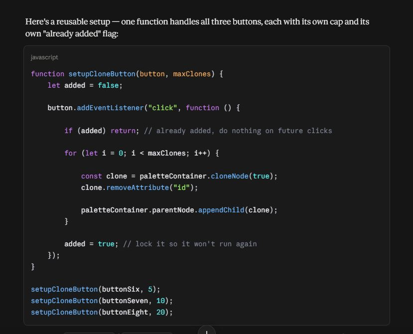
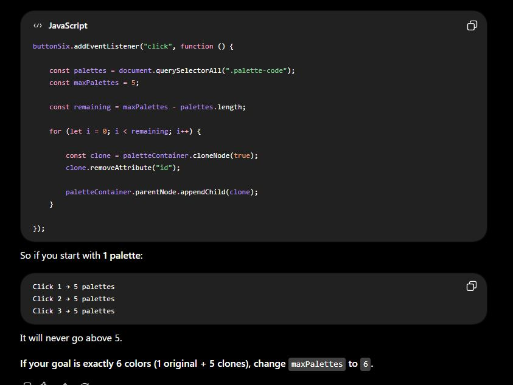
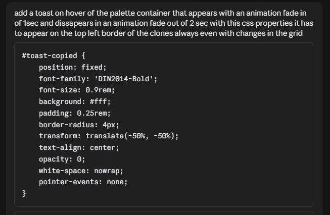

# 🎨 Colorfly Studio – Generador web de paletas.
## ¿Qué es esta web?
Un sencillo generador de paletas de colores desarrollado con HTML, CSS y JavaScript.
Colorfly es una web interactiva que permite generar paletas de colores aleatorias. Generando de a 6, 8, o 9 colores a la vez y pudiendo seleccionar el formato de color hex y hsl. Tambien permite copiar el código hex de cada color con solo un click en sus swatches. 

## ✨ Como utilizar:
1- Elige la cantidad de colores a generar 6, 8 o 9 colores.
2- Selecciona el formato de color entre HEX y HSL.
3- Haz click en el botón CREATE para generar una paleta nueva 100% aleatoria.
4- Si deseas copiar el código HEX de cada color solo haz click sobre el mismo y se copiara a tu portapapeles.

## 🌐 Demo en vivo: 

https://martincocchinan-commits.github.io/ProyectoM1_MartinCocchiNan/

### Cómo ejecutar local

Clona el repositorio:

git clone https://github.com/martincocchinan-commits/ProyectoM1_MartinCocchiNan

### Entra a la carpeta:

**cd** ProyectoM1_MartinCocchiNan

Abre el archivo index.html directamente en tu navegador

## 📖 Estructura del proyecto

- `index.html` — Define la estructura de la página, los controles, el contenedor de la paleta y los elementos de la interfaz.
- `style.css` — Contiene los estilos visuales y las configuraciones de las grillas con una variacion simple responsive tamaño tablet.
- `script.js` — Controla la generación y conversión de colores, los clones de la paleta, el tamaño de la grilla y las interacciones.

El HTML define los controles principales con el botón `CREATE` y los botones para seleccionar paletas de 6, 8 y 9 colores.

## 🛠️ Descripción del JavaScript

### Generación de colores

`obtenerHsl()` genera valores HSL aleatorios utilizando valores aleatorios de tono, saturación y luminosidad.

`obtenerHex()` genera un color hexadecimal aleatorio.

`obtenerColorActual()` selecciona el generador según el modo actual: HSL o HEX.

### Conversión HSL / HEX

Las funciones de conversión transforman un color existente sin generar uno nuevo. Esto permite cambiar el formato mostrado manteniendo el mismo color visual.

### Tamaño de la paleta

Los clones permiten que la aplicación muestre diferentes cantidades de muestras de color sin tener que crear cada elemento manualmente. La función reconcileClones() compara la cantidad de clones existentes con la cantidad solicitada; si faltan, utiliza cloneNode(true) para duplicar la estructura de la paleta, elimina el id original y agrega la clase palette-clone, genera un color para el nuevo elemento y finalmente lo agrega al contenedor. Si hay demasiados clones, los elimina desde el último hasta alcanzar la cantidad necesaria. De esta manera, el programa puede cambiar dinámicamente entre 6, 8 y 9 colores manteniendo una estructura común para todas las muestras.

- 6 colores → 5 clones + la paleta original
- 8 colores → 7 clones + la paleta original
- 9 colores → 8 clones + la paleta original

El tamaño de la grilla se actualiza mediante `setGridSize()`.

### Botón CREATE

El botón `CREATE` ejecuta `recolorAllPalettes()`, que genera un nuevo color para cada muestra visible de la paleta.

### Copiar colores

Al hacer clic sobre una muestra de color, su valor se convierte a HEX y se copia al portapapeles. También se muestra una notificación visual. 

## 🔧 Uso de IA:
Se utilizó Claude como un asistente para lograr código más velozmente y resolver bugs que se presentaban en cada paso, siempre editando cada parte dependiendo la necesidad del usuario ya que la IA suele aplicar estilos no alineados con la búsqueda personal o cometiendo errores visuales y conceptuales que no logra prevenir.
Los prompts fueron generados de una manera modular para tener control sobre cada parte del código mientras se verificaba que funcione correctamente sin bugs testeando en forma local mientras se consultaban errores que presentaba la aplicación para mejorarla.
Tambien se utilizó el asistente Claude como corrector para automatizar limpieza de código como por ejemplo consolidar las paletas, agregar una tipografía extra para cada tipografía que carga desde el folder local del proyecto.
En cada paso de los pedidos a la IA se aplicó una lógica de que resuelva partes pequeñas para poder controlar exactamente cada sector y función del código modificando los módulos sin que la IA tome decisiones globales.

### Ejemplos de prompts y uso:
Se solicito que el codigo javascritp funciona con 2 botones extra que puedan manejar una mayor cantidad de clones generando un SeT UP CLONE BUTTON para los 3 botones desde una function call.

Se solicito que el cloner pare en 5 clones y no siga generando clones (posteriormente se arreglo para cada cantidad de clones)

Se solicito un toast en hover dando los valores de css esperados y la animacion.

## 📈 Mejoras Futuras:

Bloquear colores.

Guardar paletas generadas.

Modo oscuro/claro.

Exportar paleta completa como una imagen que se descarga desde el navegador.

Mejorar responsive para tablets y celulares.
